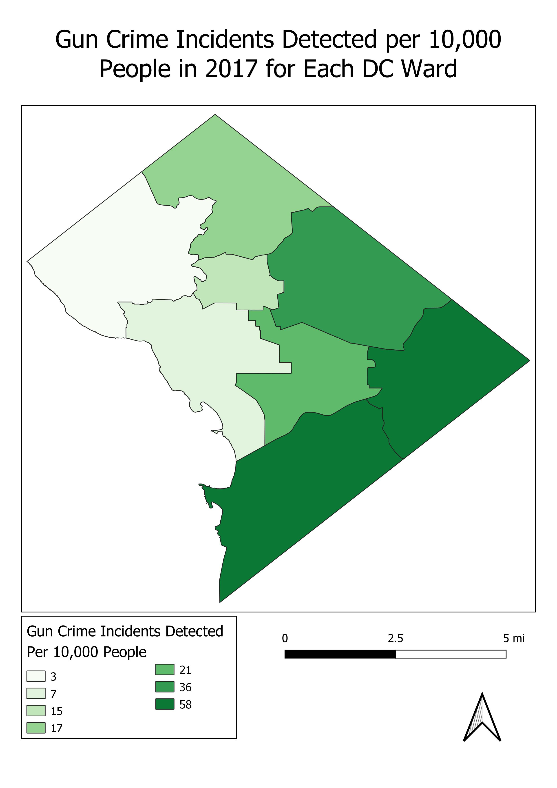
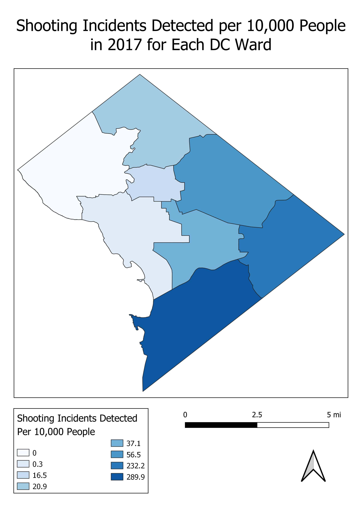

# Crime Mapping Analysis of Washington, DC in 2017
## Kirsten Ilustre
## May 11, 2020

### Introduction: 
This project was a crime mapping analysis that intended to help the Washington DC Metropolitan Police Department determine which areas an expanded gunshot detection network should cover. To accomplish this goal, the number of gun crimes committed and shooting incidents detected per 10,000 people were calculated for each of the eight DC wards. Two thematic maps displaying these calculations were created using QGIS, while the automation of these calculations was completed using the QGIS Python Console. 

### Analysis:
The data used for this analysis was derived from three sources. The first source was a point layer that gave the locations of shooting incidents detected by ShotSpotter, a surveillance technology used by the MPD to detect, locate, and alert law enforcement agencies of potential gunshot occurrences (https://opendata.dc.gov/datasets/shot-spotter-gun-shots). The dates of these incidents ranged from January 1, 2014 to March 31, 2019. The second source was a point layer that gave the locations and attributes of DC crime incidents that occurred in 2017(https://opendata.dc.gov/datasets/crime-incidents-in-2017). The third source was a shapefile layer that contained the boundaries and various attributes of DC’s 2012 election wards (https://opendata.dc.gov/datasets/ward-from-2012).

Two thematic maps were created to assist in the goals of this analysis. The first map showed the number of 2017 gun crime incidents per 10,000 in each DC ward. To create this map, a layer containing only gun crimes was created by using the "Extract by attribute" tool in QGIS, "=" as the operator, and "GUN" as the value. Next, the extracted layer was joined to the “District of Columbia 2012 Election Ward” layer using the “Join attributes by location (summary)” tool in QGIS. “Contains” was used as the geometric predicate for this tool. Following the join, the 2010 population and crime incident values for each ward were placed in an excel spreadsheet. These values were taken from the join layers attribute table under the field names “POP_2010” and “CCN_count” respectively. In the excel spreadsheet, the crime incident values for each ward were then divided by the population values and multiplied by 10,000. This calculated the number of crime incidents per 10,000 people in each ward. Following these calculations, the values were added into the join layer through the creation of a new field in its attribute table. These values were then displayed by changing the symbology settings of the layer to “categorized” and classifying values using a color ramp. The second map displayed the number of 2017 shooting incidents detected per 10,000 in each DC ward. This map was created using a very similar process as the previous map, however, it began by extracting 2017 incidents from the “Shot Spotter Gun Shots in DC” layer. This was accomplished through the “Extract by attribute” tool in QGIS with “DATETIME” as the selection attribute, “begins with” as the operator, and “2017” as the value. After this layer was created, the process to create this map followed the that of the previous map. The “OBJECTID_count” field was used for the values of shooting incidents in each ward. Both maps are displayed in the following section. 




The number of gun crimes committed per 10,000 people in each 2017 ward:
1. 15.3
2. 7.0
3. 2.7
4. 16.6
5. 36.1
6. 21.2
7. 57.8
8. 57.7

The number of shooting incidents detected by ShotSpotter per 10,000 people in each 2017 ward:
1. 16.5
2. 0.3
3. 0.0
4. 20.9
5. 56.5
6. 37.1
7. 232.2
8. 289.0

# Automation

As stated in the introduction, the calculations for this analysis were automated using the QGIS Python Console. The python code began by importing the package necessary to run the analysis and then added all three vector layers to the display. The code extracted the gun incidents from the original crime layer and defined it as a new object. Then, the code extracted shooting incidents that occurred in 2017 from the original layer and defined it into a new vector object.
```
processing.run("native:extractbyattribute",{'INPUT':shootings,'FIELD':"DATETIME",'OPERATOR':6,\
'VALUE':2017,'OUTPUT':"S:/682/Spring20/kilustre/shootings2017.shp"})
shootings2017 = "S:/682/Spring20/kilustre/shootings2017.shp"
```
Next, two joins were performed. The first one joined the extracted gun crime incidents layer into the DC wards layer, while the second one joined the extracted shooting incidents layer into the DC wards layer. The code then added the first join layer to the display and created two new attribute fields. The first attribute defined the crime incidents per person while the second attribute defined the crime incidents per 10,000 people. 
```
crimesjoin = iface.addVectorLayer(crime_join,"crime_join","ogr")
pv = crimesjoin.dataProvider() #get provder for vector layer
pv.addAttributes([QgsField('per_person',QVariant.Double),\
QgsField('per10thous',QVariant.Double)]) 
```
Next, the code prepared to update these attributes and defined two expressions to carry out the necessary calculations. The first expression divided the number of crime incidents by 2010 population values. The second expression multiplied the values calculated from the first expression by 10,000.
```
expression1 = QgsExpression('"CCN_count"/"POP_2010"')
expression2 = QgsExpression('"per_person"*10000')
```
The context for the expressions was given and then the code performed two functions. The first function calculated the number of crime incidents per person and updated its attribute field. 
```
with edit(crimesjoin):
    for f in crimesjoin.getFeatures():
        context.setFeature(f)
        f['per_person'] = expression1.evaluate(context)
        crimesjoin.updateFeature(f)
```
The second function multiplied the values from the previous function and updated its attribute fields. This function calculated the number of crime incidents per 10,000 people in each ward. 
```
with edit (crimesjoin):
for f in crimesjoin.getFeatures():
        context.setFeature(f)
        f['per10thous'] = expression2.evaluate(context)
        crimesjoin.updateFeature(f)
```
Next, the code printed a list of crime incidents per 10,000 for each ward. Finally, the code deleted the join layer from the display.  The code then repeated this process for the 2017 shooting incidents joined layer, beginning with the creation of two new attributes and ending with the deletion of the joined layer from the display.

# Results
The number of gun crimes per 10,000 people was subtracted by the number of detected shooting incidents in 2017 per 10,000 people. The wards with the greatest positive difference were wards two and three. This suggests that more gun crimes in these wards were being committed than detected by ShotSpotter in 2017. Given these results, I recommended that wards two and three should be covered be an expanded gunshot detection network. 

The results of this calculation, however, also suggests that far more shootings were being detected by ShotSpotter that gun crimes committed in 2017. This provides a limitation to my analysis as my recommendation was only based on positive differences when subtracting the number of gun crimes committed by the number of shooting incidents detected. Additionally, another limitation to my analysis is the age of the data used. Both the number of gun crimes committed and number of shootings detected were based on 2017 data. The prevalence of gun crimes across all DC wards may have significantly changed since then. Furthermore, the values for the populations of each DC ward were taken from 2010. Population values may have shifted across wards in the past 10 years.
